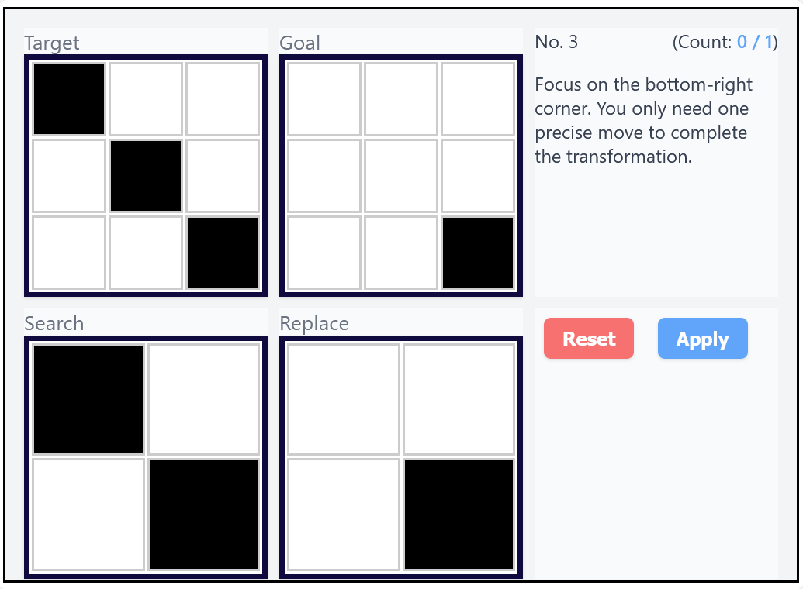

# Pixel Transform

## Introduction

Pixel Transform is a puzzle game inspired by bitmap pattern matching concepts.\
Replace specific patterns in a target matrix to match the goal matrix!

## How to play

### Objective

Transform the **Target** matrix to match the **Goal** matrix.

### Rules

* Tap cells in the **Search** and **Replace** matrices to toggle their colors.
* Click **Apply** to replace all occurrences of the **Search** pattern in the **Target**.
* Repeat until the **Target** matches the **Goal**, without exceeding the number of moves specified by the **count**.

## Development

The game is developed using [Devvit](https://www.reddit.com/devvit/), Reddit’s Developer Platform, leveraging its Webview to primarily use standard web technologies like HTML, CSS, and JavaScript.

### Run locally

Clone [ryomo/pixel-transform-devvit](https://github.com/ryomo/pixel-transform-devvit) and open the `page.html` file in your browser.

Note: Puzzle progress is not saved when playing offline.

## Acknowledgements

### Visulan

The bitmap pattern matching concept is inspired by a research paper of Visulan, a programming language that uses bitmap pattern matching.

Yamamoto, Kakuya. "Visulan: A visual programming language for self-changing bitmap." Proceedings of the International Conference on Visual Information Systems, 1996. [PDF](https://citeseerx.ist.psu.edu/document?repid=rep1&type=pdf&doi=d5335d621c7512a6dd8bfd01495b056675b1bf23)

### ARC-AGI

English: This puzzle game is created to deepen the understanding of ARC-AGI, one of the AI benchmarks. Solving such puzzles is considered difficult with current AI, and new approaches are needed to break through it. As one of those approaches, I am considering bitmap pattern matching.

[ARC Prize - What is ARC-AGI?](https://arcprize.org/arc)
